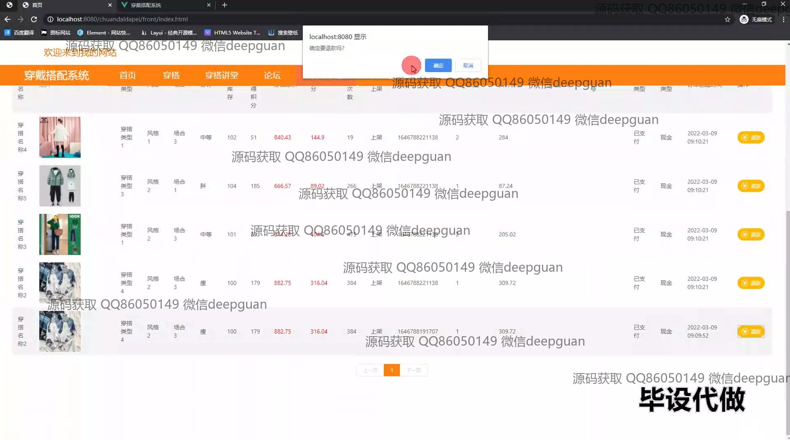

<h1 align="center">基于Web的穿戴搭配系统的设计与实现+vue</h1>

## 简介
穿戴搭配系统：提供角色为管理员和用户，通过穿搭管理、订单管理、会员等级管理、论坛管理等功能，实现一站式服装搭配推荐与用户互动。    --计算机毕业设计源码；毕设源码；java毕业设计源码

## 联系方式

<h3 align="center">获取完整代码与数据库文件 + 微信：deepguan QQ: 86050149 QQ群: 783742310</h3>

<h3 align="center">可帮忙远程部署 包运行成功！提供远程部署、修改代码、设计文档指导、代码讲解等服务！</h3>

## 功能介绍（完整见运行截图）
管理员：基础功能包括登录、用户管理、穿搭管理、订单管理、论坛管理以及会员等级管理。系统允许管理员编辑用户信息、管理商品分类及库存，处理订单发货并进行会员等级设置和优化。可通过后台管理界面管理不同板块的用户内容和论坛话题，实时查看和调整平台运行状态。

用户：用户可通过主界面访问和浏览不同风格的穿搭和商品信息，支持选购、排序及价格筛选。个人中心模块提供个人信息、订单状态、地址修改、收藏夹管理以及订单评价功能。用户可以在论坛分享和讨论穿搭体验，并在穿搭讲堂获取搭配建议。

访客：无需注册即可浏览网站主页，查看推荐搭配和用户评论。访客可以访问穿搭讲堂获取搭配灵感，并通过导航栏了解系统的基本功能和特色服务。

付款系统：支持多种支付方式，包括微信、支付宝和银行支付，用于购买商品、会员充值和订单结算。用户在个人中心可查看历史交易记录及管理支付方式。

## 运行截图

本代码来源于网络,仅供学习参考使用!

